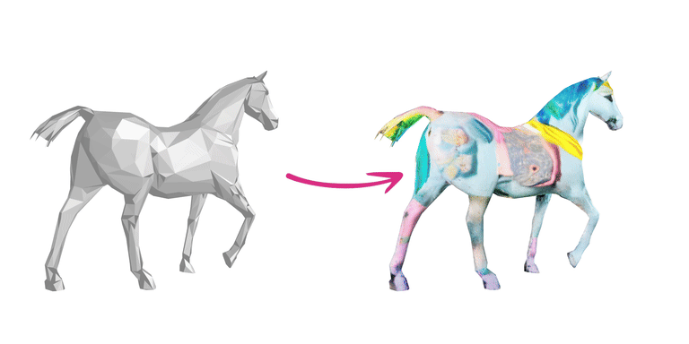

# Breathing New Life into 3D Assets with Generative Repainting

[](https://www.obukhov.ai/repainting_3d_assets)
[](https://colab.research.google.com/drive/18mDpuYO5TuI6tSkQk9ls2rS9sciNpR-c?usp=sharing)
[](https://hub.docker.com/r/toshas/repainting_3d_assets)

This repository complements our BMVC'23 paper titled "Breathing New Life into 3D Assets with Generative Repainting" by
[Tianfu Wang](https://scholar.google.com/citations?user=ZqWxrkwAAAAJ&hl=en), 
[Menelaos Kanakis](https://scholar.google.ch/citations?user=4kTFtHgAAAAJ&hl=en),
[Konrad Schindler](https://igp.ethz.ch/personen/person-detail.html?persid=143986),
[Luc Van Gool](https://scholar.google.ch/citations?user=TwMib_QAAAAJ&hl=en), and
[Anton Obukhov](https://www.obukhov.ai/).

As the title suggests, our method takes a 3D model and paints it according to a text prompt:

<p align="center">
<br>
Left: Input 3D model. Right: The same model painted by our method with the user-specified text prompt: "Pastel superhero unicorn".
</p>

## Interactive Demo Gallery

Explore select models from the ShapeNetSem dataset, showcasing their texturing by our method and competition, on the project page: 

[](https://www.obukhov.ai/repainting_3d_assets)

## Quick Start

To paint your own 3D model, use Colab or your local environment as described below. 

### Local Environment (15 min, recommended)

Clone the repository and run the command below in the repository root. 
The process finishes in under 15 min on a machine with a GPU.

```shell
sh scripts/docker_run.sh assets/horse.ply out/ "pastel superhero unicorn"
```

### Google Colab (30 min)

Colab requires the GPU runtime (and thus a subscription) and takes an extra 15 minutes to install the environment.
It eliminates the need to run the application locally and use Docker. 
Unlike the dockerized environment, the Colab functionality is not guaranteed. Click the badge to start:

[](https://colab.research.google.com/drive/18mDpuYO5TuI6tSkQk9ls2rS9sciNpR-c?usp=sharing)

## Development

Run `sh scripts/setup.sh <WORK>` to set up a new working directory pointed to by `<WORK>`. 
This requires ~30 GB of disk space and installs a custom Python runtime with all dependencies.

Once the setup completes, use `sh scripts/conda_run.sh <WORK> <PATH_MODEL> <PATH_OUTPUT_DIR> <PROMPT>` to paint your 3D model located at `PATH_MODEL` according to the text `PROMPT` and put the results in `PATH_OUTPUT_DIR`.

### ShapeNetSem

Rerun `sh scripts/setup.sh <WORK> --with-shapenet` to complement the setup with the dataset. 

Once the setup completes, use `sh scripts/conda_run_shapenet.sh <WORK> <ID_1> ... <ID_N>` to process models from the ShapeNetSem dataset.

## Citation :unicorn:

Please support our research by citing our paper:
```
@inproceedings{wang2023breathing,
    title={Breathing New Life into 3D Assets with Generative Repainting},
    author={Wang, Tianfu and Kanakis, Menelaos and Schindler, Konrad and Van Gool, Luc and Obukhov, Anton},
    booktitle={Proceedings of the British Machine Vision Conference (BMVC)},
    year={2023},
    publisher={BMVA Press}
}
```


## License

This work is licensed under a [Creative Commons Attribution-NonCommercial-ShareAlike 4.0 International License][cc-by-nc-sa].

[![CC BY-NC-SA 4.0][cc-by-nc-sa-image]][cc-by-nc-sa]

[cc-by-nc-sa]: http://creativecommons.org/licenses/by-nc-sa/4.0/
[cc-by-nc-sa-image]: https://licensebuttons.net/l/by-nc-sa/4.0/88x31.png
[cc-by-nc-sa-shield]: https://img.shields.io/badge/License-CC%20BY--NC--SA%204.0-lightgrey.svg